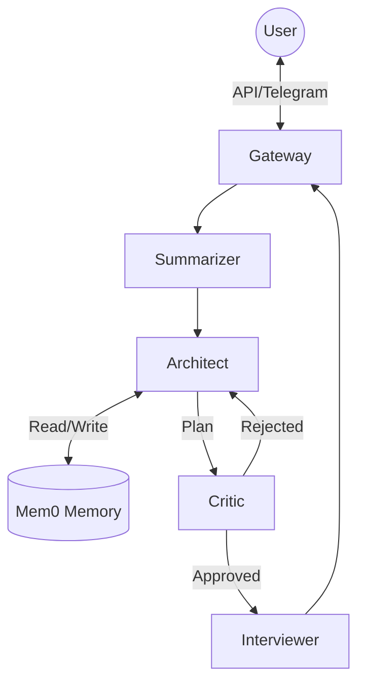

# Deep Profiling & Biography Agent System

## 🚀 Abstract
This project implements an **Autonomous Dialogue System** designed for deeply profiling users and collecting their biographies through natural conversation. 

Built with **Python 3.12**, **LangGraph**, and **Mem0**, it features an intelligent agent team that plans interviews, validates answers in real-time, and builds a structured knowledge base of the user's life events.

> **Key Capabilities:**
> - **Long-term Memory:** Uses `Mem0` to remember facts across sessions.
> - **Structured Planning:** The **Architect** agent plans interview sessions by topics (Spheres).
> - **Self-Correction:** The **Critic** agent validates user answers to ensure quality data collection.
> - **Multi-Tenancy:** Strict data isolation by user ID.

## 🛠️ Technology Stack
- **Language:** Python 3.12 (managed by `uv`)
- **Orchestration:** LangChain, LangGraph (Stateful Agents)
- **Memory:** Mem0 (Local Vector Store)
- **Database:** PostgreSQL/SQLite (Checkpoints & App Data)
- **Interface:** Telegram Bot API
- **Observability:** LangFuse (Self-hosted, Docker)
- **Infrastructure:** Docker (Fully containerized)

## 🏗️ Architecture
The system operates using a role-based agent workflow:

1.  **Gateway (Telegram/API):** Handles user I/O.
2.  **Summarizer:** Compresses conversation history to manage context window before planning.
3.  **Architect (Global Planner):**
    -   Manages "Spheres" of life (Childhood, Career, etc.).
    -   Generates interview plans based on existing memory.
    -   Tracks global progress.
4.  **Session Loop (Interviewer + Critic):**
    -   **Critic:** Validates the plan and safety *before* execution.
    -   **Interviewer:** Conducts the dialogue based on the Architect's approved plan.



## ⚡ Quick Start

### Prerequisites
- Docker & Docker Compose
- `uv` Package Manager

### 1. Initialize Environment
```bash
uv sync
```

### 2. Configure
Copy `.env.example` to `.env` and set your API keys (OpenRouter, Telegram).

### 3. Start System
```bash
docker-compose up -d
```

This starts all services: PostgreSQL, Redis, Qdrant, LangFuse, and the app itself. LangFuse will be available at `http://localhost:3000`.

## 📂 Project Structure
```
src/
├── app/            
│   ├── graph/      # LangGraph Workflows (Architect, Interviewer, Critic, Summarizer)
│   ├── nodes/      # Agent implementations
│   ├── prompts/    # Jinja2 prompt templates
│   └── services/   # Application services (ContextManager)
├── domain/         # Entities (Sphere, Plan, Profile)
├── entrypoints/    # API & Telegram handlers
├── infra/          # Adapters (Mem0, DB, Redis, Security)
├── middleware/     # Rate limiting & Budgeting
└── main.py         # Entrypoint
```

## 📚 Documentation
- **Instructions**: [Agent Playbook](docs/planning/README.md)
