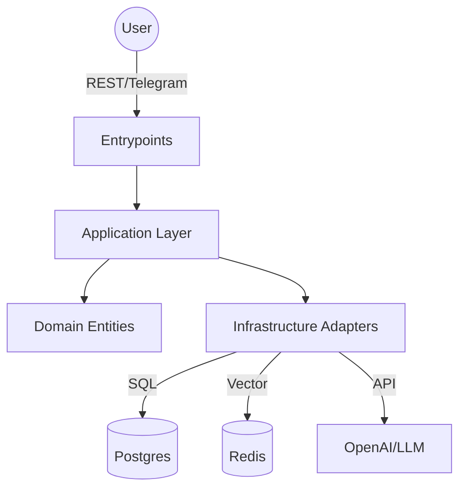

# Modular Agentic Monolith (Python 3.14 + LangGraph)

## 🚀 Abstract
This project demonstrates a production-grade **Agentic Monolith** built with **Python 3.14**, **FastAPI**, and **LangGraph**. It implements a sophisticated "Architect-Critic-Worker" workflow where agents collaborate to solve user tasks, featuring:
-   **Cyclic Graph:** Self-correcting feedback loops (Architect <-> Critic).
-   **Persistence:** Asynchronous Postgres checkpoints for long-running threads.
-   **Hexagonal Architecture:** Strictly decoupled Domain, Application, and Infrastructure layers.
-   **Resilience:** Exponential backoff and circuit breakers for LLM calls.

## 🛠️ Technology Stack
-   **Language:** Python 3.14 (managed by `uv`)
-   **Orchestration:** LangGraph (Stateful Agents)
-   **API:** FastAPI (Async/Await)
-   **Database:** PostgreSQL 16 (AsyncPG + SQLAlchemy)
-   **Vector Store:** Redis Stack
-   **Validation:** Pydantic V2 (Strict)
-   **Observability:** LangFuse (Prepared)

## 🏗️ Architecture
The project follows **Hexagonal Architecture (Ports & Adapters)**:


## ⚡ Quick Start

### Prerequisites
-   Docker & Docker Compose
-   `uv` Package Manager

### 1. Initialize Environment
```bash
uv sync
```

### 2. Start Infrastructure
```bash
docker-compose up -d
```

### 3. Run Application
```bash
uv run uvicorn src.main:app --reload
```
API Docs available at: `http://localhost:8000/docs`

### 4. Run Tests
```bash
uv run pytest
```

## 🧠 Workflows
### Chat Agent
1.  **User Loop:** User sends message -> stored in `AgentState`.
2.  **Architect:** Analyzes intent, generates `PlanSchema`.
3.  **Critic:** Reviews plan (`CritiqueSchema`). 
    -   *If Rejected:* Loops back to Architect.
    -   *If Approved:* Proceeds to Interviewer.
4.  **Interviewer:** Generates response.

## 📂 Project Structure
```
src/
├── app/            # Application Business Logic (Graph, Services)
├── domain/         # Pure Logic (Entities, Ports)
├── entrypoints/    # External Interfaces (API, Telegram)
├── infra/          # Adapters (DB, LLM, Vector)
└── settings.py     # Configuration
```

## 🛡️ Quality Assurance
-   **Linting:** `uv run ruff check src`
-   **Typing:** `uv run mypy src`
-   **Testing:** `uv run pytest`
