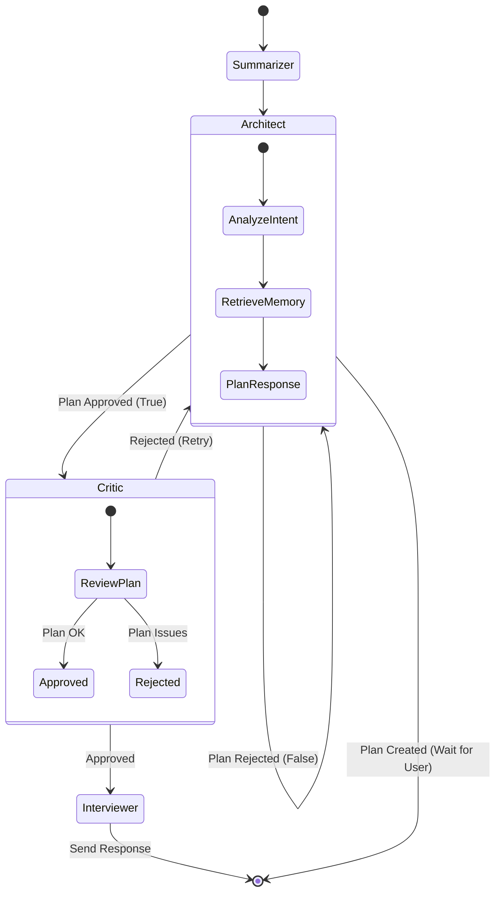

# System Architecture

## Overview
The Agent Interview application is built using a **Modular Monolith** approach with **Hexagonal Architecture** (Ports and Adapters). This design ensures that the core domain logic (User entities, Spheres) and the application workflow (Agent Graph) are isolated from external infrastructure (Database, LLM, Web API).

## High-Level Context
The system acts as an intelligent intermediary between a User (via Web or Telegram) and a suite of AI capabilities (LLM, Memory), persisting state to a robust database.

```mermaid
graph TD
    User[User / Client] -->|HTTP REST| API[API Gateway (FastAPI)]
    Telegram[Telegram User] -->|Webhook| API

    subgraph Core_Application
        API -->|Invokes| Graph[Agent Graph (LangGraph)]
        
        subgraph Graph_Nodes
            Summarizer[Summarizer Node]
            Architect[Architect Node]
            Critic[Critic Node]
            Interviewer[Interviewer Node]
        end
        
        Graph --> Summarizer
        Summarizer --> Architect
        Architect -->|Plan Approved?| Critic
        Architect -->|Wait for User| End([END])
        Critic -->|Approved| Interviewer
        Critic -->|Rejected| Architect
        Interviewer --> End
    end

    subgraph Infrastructure
        Graph -->|Persists State| Postgres[(PostgreSQL)]
        Graph -->|Vector Search| Memory[(Qdrant / Mem0)]
        Graph -->|Inference| LLM[LLM Provider (OpenAI)]
    end
```

## Agent Graph Workflow
The core logic is driven by a state machine (LangGraph). The workflow adapts based on the conversation state.

1.  **Summarizer**: Compresses older messages to maintain context window efficiency. Always runs first.
2.  **Architect**: Analyzes the user's intent, retrieves relevant memories, and checks the user's profile/sphere.
    *   *No Sphere*: Creates a new sphere.
    *   *Plan Needed*: Generates a plan and halts for **User Approval** (`END`).
    *   *Plan Approved*: Proceeds to Critic.
    *   *Plan Rejected*: Regenerates plan.
3.  **Critic**: Reviews the Architect's plan for safety and quality.
    *   *Critique Pass*: Proceeds to Interviewer.
    *   *Critique Fail*: Sends back to Architect (Retry Loop).
4.  **Interviewer**: Generates the actual response using the approved plan.



## Key Components

### 1. Domain Layer (`src/domain/`)
Contains pure Python objects (Entities) and Interfaces (Ports) defining the business rules.
- **Entities**: `UserProfile`, `Sphere`, `Memory`.
- **Ports**: `UserRepositoryProtocol`, `SphereRepositoryProtocol`.

### 2. Application Layer (`src/app/`)
Orchestrates the business logic.
- **Graph**: Contains the LangGraph workflow (`src/app/graph/`).
- **Nodes**: Agent implementations (`src/app/graph/nodes/`).
- **Services**: `ContextManager`, `CostTracker`.
- **Prompts**: Jinja2 templates for LLM interaction.

### 3. Infrastructure Layer (`src/infra/`)
Implements the interfaces defined in the Domain.
- **DB**: SQLAlchemy models and repositories.
- **LLM**: OpenAI client wrapper.
- **Memory**: `mem0ai` client implementation.

### 4. Entrypoints (`src/entrypoints/`)
The "Ports" that allow the outside world to talk to the application.
- **API**: FastAPI routers.
- **Telegram**: Webhook handlers.
