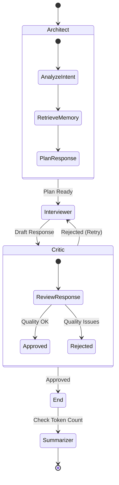

# System Architecture

## Overview
The Agent Interview application is built using a **Modular Monolith** approach with **Hexagonal Architecture** (Ports and Adapters). This design ensures that the core domain logic (User entities, Spheres) and the application workflow (Agent Graph) are isolated from external infrastructure (Database, LLM, Web API).

## High-Level Context
The system acts as an intelligent intermediary between a User (via Web or Telegram) and a suite of AI capabilities (LLM, Memory), persisting state to a robust database.

```mermaid
graph TD
    User[User / Client] -->|HTTP REST| API[API Gateway (FastAPI)]
    Telegram[Telegram User] -->|Webhook| API

    subgraph Core_Application
        API -->|Invokes| Graph[Agent Graph (LangGraph)]
        
        subgraph Graph_Nodes
            Architect[Architect Node]
            Interviewer[Interviewer Node]
            Critic[Critic Node]
            Summarizer[Summarizer Node]
        end
        
        Graph --> Architect
        Architect --> Interviewer
        Interviewer --> Critic
    end

    subgraph Infrastructure
        Graph -->|Persists State| Postgres[(PostgreSQL)]
        Graph -->|Vector Search| Memory[(Qdrant / Mem0)]
        Graph -->|Inference| LLM[LLM Provider (OpenAI)]
    end
```

## Agent Graph Workflow
The core logic is driven by a state machine (LangGraph). The workflow adapts based on the conversation state.

1.  **Start**: Conversation begins or resumes.
2.  **Architect**: Analyzes the user's intent, retrieves relevant memories, and checks the user's profile/sphere. It plans the next move.
3.  **Interviewer**: Generates the actual response, asking questions or providing feedback based on the Architect's plan.
4.  **Critic** (Optional): Reviews the Interviewer's response for quality and safety before sending it to the user.
5.  **Summarizer**: Runs periodically to condense long conversation histories into a summary, preventing context window overflow.



## Key Components

### 1. Domain Layer (`src/domain/`)
Contains pure Python objects (Entities) and Interfaces (Ports) defining the business rules.
- **Entities**: `UserProfile`, `Sphere`, `Memory`.
- **Ports**: `UserRepositoryProtocol`, `SphereRepositoryProtocol`.

### 2. Application Layer (`src/app/`)
Orchestrates the business logic.
- **Graph**: Contains the LangGraph workflow and Node definitions.
- **Services**: `MemoryService`, `ContextManager`.

### 3. Infrastructure Layer (`src/infra/`)
Implements the interfaces defined in the Domain.
- **DB**: SQLAlchemy models and repositories.
- **LLM**: OpenAI client wrapper.
- **Memory**: `mem0ai` client implementation.

### 4. Entrypoints (`src/entrypoints/`)
The "Ports" that allow the outside world to talk to the application.
- **API**: FastAPI routers.
- **Telegram**: Webhook handlers.
